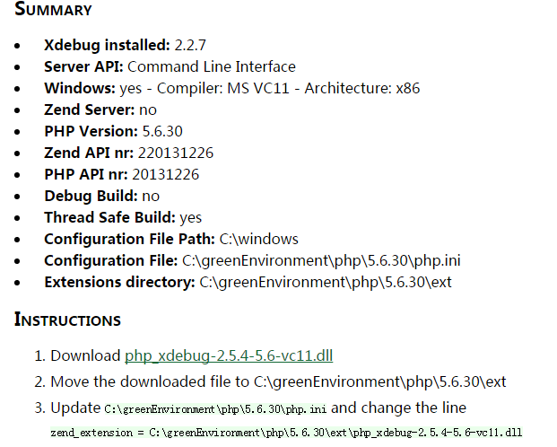

Xdebug的基本使用
===============

> 其中用到的PHP路径请替换成您自己的对应的PHP路径。


## 安装

1. 打开cmd执行命令
```bash
# 修改成为你自己的php路径
C:\greenEnvironment\php\5.6.30\php.exe -i > info.txt
```

2. 找到info.txt文件, 并复制里面的文本到网站<https://xdebug.org/wizard.php>中的文本框中,点击按钮<kbd>Analyse my phpinfo() output</kbd>

3. 然后将会显示您的PHP环境信息, 点击下面的下载链接(如下图所示), 下载这个dll文件到`C:\greenEnvironment\php\5.6.30\ext`目录中



4. 修改php.ini配置文件, 增加一行

```ini
# 路径指向您下载的dll文件
zend_extension=C:\greenEnvironment\php\5.6.30\ext\php_xdebug-2.5.4-5.6-vc11.dll
```

5. 验证安装结果，打开cmd执行命令

```bash
# 出现xdebug字样则安装成功，重启一下Apache或者nginx
C:\greenEnvironment\php\5.6.30\php.exe -m | findstr xdebug
```


## 性能分析

1. 安装Chrome辅助插件[xdebug helper](https://chrome.google.com/webstore/detail/eadndfjplgieldjbigjakmdgkmoaaaoc) ([打不开？查看不翻墙安装Chrome插件方法](../chrome.md))

2. 修改php.ini配置文件，加入如下代码，记得重启Apache或者nginx

> 记得创建xdebug目录

```ini
[Xdebug]
xdebug.profiler_enable_trigger=on
xdebug.profiler_output_dir="C:\greenEnvironment\php\5.6.30\xdebug"
```

3. 生成profile文件

新建一个PHP脚本文件，写一些简单的代码，用Chrome浏览器打开这个脚本，并将Chrome插件`xdebug helper`切换至**profile**(如下图所示)，刷新浏览器，这时会在`C:\greenEnvironment\php\5.6.30\xdebug`目录中生成profile文件（cachegrind.out.****）


4. [下载profile分析软件](https://sourceforge.net/projects/wincachegrind/)，并打开生成好的profile文件，此时就能看见函数调用、执行时间等信息。


## 程序调试(Sublime Text 3)

1. 修改php.ini配置，重启Apache或者nginx

```ini
[Xdebug]
xdebug.remote_enable = on
xdebug.remote_handler = dbgp
xdebug.remote_host = 127.0.0.1
xdebug.remote_port = 9000
```

2. 安装Sublime插件[Xdebug Client](https://packagecontrol.io/packages/Xdebug%20Client)

3. 简单使用

    - 新建一个PHP文件，写一些测试代码，移动到需要下断点的地方按下<kbd>ctrl+f8</kbd>添加一个断点。
    - 按下<kbd>ctrl+shift+f9</kbd>开启调试模式，此时会从底部弹出一个调试窗口。
    - 用浏览器访问该PHP程序，将 Chrome辅助插件[xdebug helper](#性能分析)切换至`Debug`模式，刷新浏览器，正确的情况下此时编辑器会出现调试信息，如图所示
    - 按<kbd>ctrl+shift+f6</kbd>执行下一行代码。
    - 按<kbd>ctrl+shift+f10</kbd>关闭调试。

    - 

**`Xdebug Client`常用配置**

```js
{
    // 配置打印信息的显示
    "max_children": 32,
    "max_data": 1024,
    "max_depth": 3,
    
    // 遇到哪些报错时断点
    "break_on_exception": [
        // E_ERROR, E_CORE_ERROR, E_COMPILE_ERROR, E_USER_ERROR
        "Fatal error",
        // E_RECOVERABLE_ERROR (since PHP 5.2.0)
        "Catchable fatal error",
        // E_WARNING, E_CORE_WARNING, E_COMPILE_WARNING, E_USER_WARNING
        "Warning",
        // E_PARSE
        "Parse error",
        // E_NOTICE, E_USER_NOTICE
        "Notice",
        // E_STRICT
        "Strict standards",
        // E_DEPRECATED, E_USER_DEPRECATED (since PHP 5.3.0)
        "Deprecated",
        // 0
        "Xdebug",
        // default
        "Unknown error"
    ],
    
    // 关闭调试同时关闭调试窗口
    "close_on_stop": true,
}
```

**`Xdebug Client`相关的快捷键**

* <kbd>ctrl+f8</kbd>:添加/删除断点
* <kbd>ctrl+shift+f5</kbd>:运行到下一个断点Run
* <kbd>ctrl+shift+f6</kbd>:单步Step Over
* <kbd>ctrl+shift+f7</kbd>:进入Step Into
* <kbd>ctrl+shift+f8</kbd>:进出Step Out
* <kbd>ctrl+shift+f9</kbd>:开启调试
* <kbd>ctrl+shift+f10</kbd>:关闭调试
